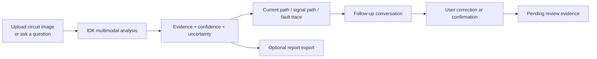

# `CircuitSight AI` / `IDK`

### Intelligent Diagnostic Kernel for real-world circuit debugging

[](https://circuitai-ezw8hzmd.manus.space)
[](https://react.dev/)
[](https://www.typescriptlang.org/)
[](https://vite.dev/)
[](https://expressjs.com/)
[](https://trpc.io/)
[](https://orm.drizzle.team/)
[](https://vitest.dev/)

> **CircuitSight AI** turns a circuit photograph, schematic, or electronics question into a grounded diagnostic conversation. Its assistant identity, **IDK — Intelligent Diagnostic Kernel**, is designed to explain what is visible, separate evidence from uncertainty, and guide the next useful check.

[Launch the live workspace](https://circuitai-ezw8hzmd.manus.space) · [Explore the repository](https://github.com/Vishalkumaran2007/CircuitSightAI) · [Read the project history](https://github.com/Vishalkumaran2007/CircuitSightAI/commits/main)

---

## What it does

CircuitSight is a visual electronics debugging and learning platform for breadboards, schematics, and circuit questions. Upload a clear image or ask a question in the workspace, then continue the conversation with context-aware answers, confidence language, current-path explanations, signal-path reasoning, and fault-tracing guidance.

The platform deliberately avoids presenting an uncertain visual inference as a measurement. When the evidence is incomplete, IDK says what is missing and asks for the next useful image, schematic, description, or measurement.

| Capability | Product behavior |
| --- | --- |
| **Visual circuit analysis** | Interprets user-provided circuit images with multimodal AI assistance. |
| **Conversational diagnosis** | Maintains thread context so follow-up questions remain connected to the same analysis. |
| **Grounded reasoning** | Separates visible evidence, likely findings, uncertainty, and recommended checks. |
| **Complex-circuit guidance** | Supports current-path, signal-path, fault-trace, schematic, PCB, analog, digital, and mixed-signal explanations. |
| **Correction learning** | Stores user corrections and confirmations as reviewable evidence rather than silently retraining on unverified claims. |
| **Website help** | Provides a separate product-support chatbot for account, workflow, settings, and platform questions. |
| **Reporting** | Preserves structured findings, confidence information, original-image context, and PDF export when explicitly requested. |
| **Visual Signal** | Provides paired light/dark palettes, a side-by-side theme preview, high contrast, and route-scoped appearance controls. |

---

## Product flow



### A workspace built around the signal

1. **Capture** — submit a circuit image or describe the problem.
2. **Inspect** — IDK identifies visible components, connections, likely fault points, and missing evidence.
3. **Understand** — receive a conversational explanation adapted to the diagnostic context.
4. **Verify** — follow recommended checks for power, polarity, continuity, and signal flow before energizing a circuit.
5. **Learn** — add a correction or confirmation that is stored for explicit review.

---

## Interface language

The UI follows a Kinetic Typography / brutalist visual direction: sharp geometry, high-contrast surfaces, technical labels, hard borders, acid signal accents, and responsive layouts. The current interface combines **Space Grotesk** for display and body text with **Monaspace Krypton** for diagnostic metadata.

The appearance system includes 16 paired visual signals. Each palette has a light reference and a dark reference, and the Visual Signal page can compare both variants without changing the active workspace mode.

> **Design principle:** make the signal visible, make uncertainty explicit, and keep the next action clear.

---

## Stack

| Layer | Technology |
| --- | --- |
| Frontend | React 19, TypeScript, Vite, Tailwind CSS 4, Wouter |
| UI system | Radix UI primitives, Lucide icons, Framer Motion, Streamdown |
| API layer | Express 4, tRPC 11, React Query |
| Persistence | Drizzle ORM, MySQL/TiDB, authenticated user threads and preferences |
| AI and media | Manus multimodal LLM integration, image previews, structured analysis responses |
| Storage and reports | S3-compatible storage helpers, client-side PDF report generation |
| Validation | Vitest, TypeScript checks, rendered route contracts, responsive CSS contracts |

---

## Run locally

### Prerequisites

Use Node.js 22 or later and pnpm. The server-side environment also requires the project’s database, authentication, storage, and built-in AI integration variables.

```bash
pnpm install
```

### Development

```bash
pnpm dev
```

The development server is started by the project’s Express/Vite entrypoint and binds to the environment-provided port.

### Quality checks

```bash
pnpm exec tsc --noEmit
pnpm test
pnpm build
```

Database migrations are generated through the project’s Drizzle workflow. Do not commit local environment secrets; configure the required variables through the deployment environment.

---

## Repository map

```text
client/src/pages/       Route-level product experiences
client/src/components/  Reusable workspace, account, report, and UI components
client/src/contexts/    Theme and application state
server/                 tRPC procedures, database helpers, and tests
drizzle/                Database schema and migrations
shared/                 Shared types and constants
```

The most important product surfaces are:

- `client/src/pages/Workspace.tsx` — authenticated circuit analysis workspace.
- `client/src/pages/VisualSignal.tsx` — paired light/dark theme selection and preview.
- `client/src/components/AIChatBox.tsx` — reusable conversational interface.
- `server/routers.ts` — analysis, preferences, help chat, and feedback procedures.
- `drizzle/schema.ts` — persisted users, threads, messages, preferences, and reviewable feedback.

---

## Safety and evidence boundaries

CircuitSight is an analysis aid, not a replacement for electrical measurement or safe lab practice. A photograph cannot prove live voltage, current, continuity, component ratings, thermal conditions, or hidden connections. Verify power, polarity, continuity, and component behavior with appropriate instruments and safe procedures before energizing a circuit.

User corrections are captured as **pending review evidence**. They are not silently treated as verified truth, and the application does not fabricate reviews, ratings, testimonials, measurements, or external validation.

---

## Team credits

| Contributor | Role | Responsibility |
| --- | --- | --- |
| **Vishalkumaran V** | Developer | Full-stack development, technical implementation, AI integration, application architecture, circuit analysis workflow, and platform development. |
| **Sankarprasasth S** | Idea & Concept | Originated the core idea, defined the initial problem statement and project concept, and contributed to the project vision and direction. |
| **Rohini S** | UI/UX Design | UI/UX selection, design direction, visual design decisions, and user experience planning. |
| **Sayasree T K** | R&D & Pitching | Research and development, concept validation, pitch preparation, and presentation strategy. |

> **Built by a team of engineers, designers & researchers.**

---

## License and project status

This repository is the active CircuitSight AI / IDK application project. Review the repository’s existing licensing and contribution policies before redistributing or extending the codebase.

[](https://github.com/Vishalkumaran2007/CircuitSightAI)
# CircuitSight-AI

